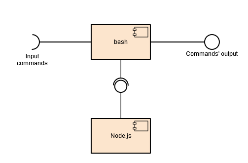

# Arquitetura de Software

<a name="index"/>
## Índice
1. [Introdução](#introduction)
2. [Vista Lógica](#logicalview)
3. [Vista de Processo](#processview)
4. [Vista de Distribuição](#deploymentview)
5. [Vista de Implementação](#implementationview)
6. [Cenários de Utilização](#scenarioview)

<a name="introduction"/>
## Introdução

Neste relatório iremos utilizar o modelo de vistas [**4+1**](https://en.wikipedia.org/wiki/4%2B1_architectural_view_model) de Arquitectura de Software para descrever o projeto que selecionámos. Este modelo é útil porque representa o mesmo software através de diferentes pontos de vista, simultaneamente. As 5 componentes deste modelo são as seguintes:
 - vista lógica
 - vista de processo
 - vista de implementação
 - vista de distribuição
 - cenários de utilização

Iremos utilizar diagramas UML para representar cada uma das vistas.

<a name="logicalview"/>
## Vista Lógica

A vista lógica apresenta o projeto na sua organização e relação entre pastas, assim como importação de módulos necessários ao funcionamento do programa.

Assim, optámos por utilizar um diagrama de [pacotes](https://en.wikipedia.org/wiki/Package_diagram) para representar esta vista.

<a name="processview"/>
## Vista de Processo
A vista de processo é responsável por mostrar o aspecto dinâmico do sistema e foca-se em 3 aspectos:
- processos do sistema
- o modo como comunicam
- o comportamento geral do sistema durante a sua utilização. 

Assim, optámos por utilizar um diagrama de [actividade](https://en.wikipedia.org/wiki/Activity_diagram) para representar esta vista.

<a name="deploymentview"/>
## Vista de Distribuição
A vista de distribuição apresenta tanto o software como o hardware em que este é executado, assim como as suas interações. O cash foi concebido para ser corrido em ambiente Windows, apesar de também poder ser executado em Linux; assim, é necessário ter um computador com sistema operativo Windows, assim como o node.js instalado.

Por estes motivos optámos por utilizar um diagrama de [distribuição](https://en.wikipedia.org/wiki/Deployment_diagram) para representar esta vista.

<a name="implementationview"/>
## Vista de Implementação
A vista de implementação demonstra a perspectiva do programador e a sua preocupação com a gestão do software.

Por esse motivo optámos por utilizar um diagrama de [componentes](https://en.wikipedia.org/wiki/Component_diagram) para representar esta vista.

<a name="scenarioview"/>
## Cenários de Utilização
Os cenários de utilização têm como objectivo demonstrar a interação entre o utilizador e a aplicação. Servem também para verificar o design da arquitectura e ,além disso, são o inicio de possíveis protótipos de arquitetura.
Assim, optámos por utilizar um diagrama [use-case](https://en.wikipedia.org/wiki/Use_case) para representar esta vista.

